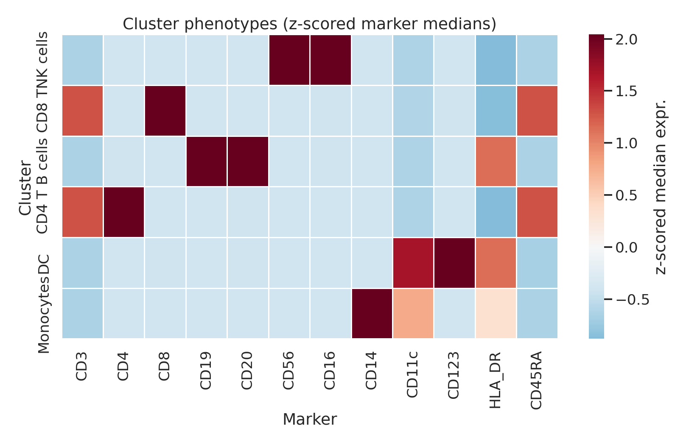
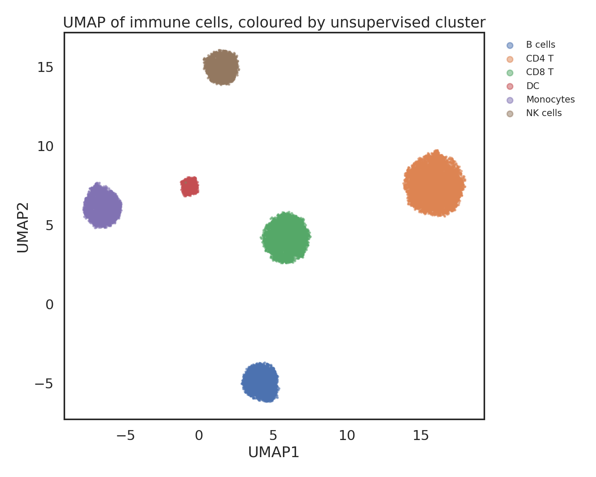
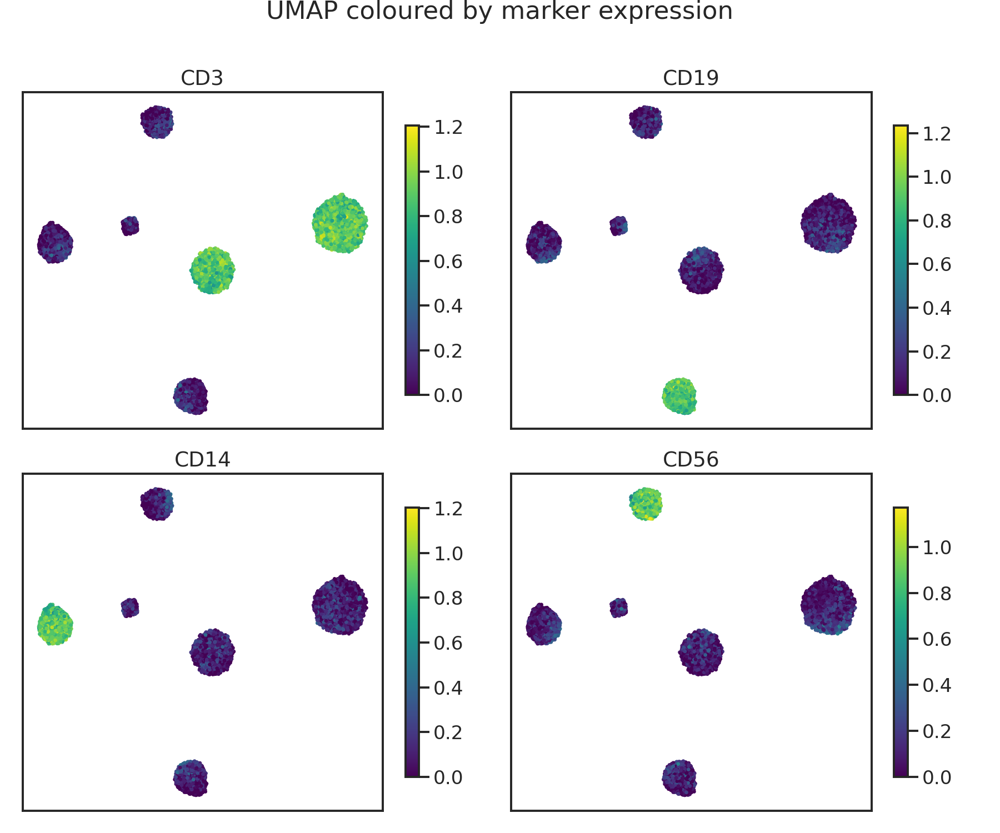
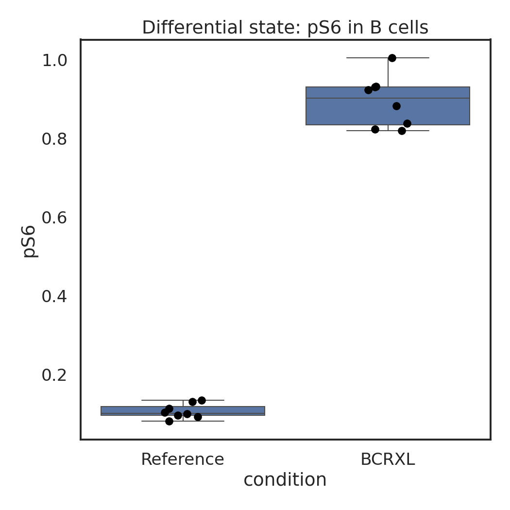

# Unsupervised Clustering of High-Dimensional Flow Cytometry Data

A small, fully reproducible pipeline that takes multi-sample cytometry
data and, **without any manual gating**, discovers immune-cell
populations and tests how they change between experimental conditions.

It reproduces the logic of a classic translational-immunology
experiment: peripheral-blood immune cells from several patients,
measured **before vs. after stimulation**, where the goal is to find a
*pharmacodynamic* signal — a measurable change in the cells caused by a
treatment.

> **Headline result:** the pipeline recovers all six immune-cell
> populations from scratch and correctly identifies that the signalling
> marker **pS6 is strongly induced in B cells** after stimulation
> (median 0.10 → 0.90, p ≈ 1.6 × 10⁻⁴), while no other population
> changes — exactly the kind of target-engagement readout used in
> early-stage oncology programs.

> **Start here:** [`flow_cytometry_analysis.ipynb`](flow_cytometry_analysis.ipynb)
> is a fully-executed, paper-style notebook (narrative + code + inline
> figures) that tells the whole story top to bottom and renders directly
> on GitHub. The `src/` scripts are the same analysis as standalone
> command-line files.

---

## Why this project

High-parameter (multicolor / spectral / mass) cytometry measures dozens
of proteins on millions of single cells. Manually drawing gates on 2-D
plots does not scale and is subjective. The field has therefore moved to
**unsupervised, computational analysis**: cluster the cells by their full
marker profile, visualise them with non-linear dimensionality reduction
(UMAP), and then test for differences between groups.

This repo is a compact, end-to-end demonstration of that workflow,
written so each step is readable and runnable.

---

## The analysis pipeline

| Step | What it does | Why it matters |
|------|--------------|----------------|
| **1. Load** | Pool per-sample tables, attach patient/condition metadata | Cytometry experiments are many files; analysis is joint |
| **2. arcsinh transform** (cofactor 5) | Compress bright signals, spread out dim ones | The standard transform that makes cytometry data analysable |
| **3. FlowSOM-style clustering** | Self-Organising Map (10×10 = 100 nodes) → hierarchical meta-clustering | Defines populations from data, not from hand-drawn gates |
| **4. Annotation** | Median marker profile per cluster (heatmap) → cell-type labels | Turns anonymous clusters into named biology |
| **5. UMAP** | 2-D embedding for visual QC | See the population structure; sanity-check with marker overlays |
| **6. MDS QC** | One point per sample | Spot batch effects / outlier samples before trusting results |
| **7. Differential abundance** | Do population *sizes* differ between conditions? | "Are there more/fewer of a cell type after treatment?" |
| **8. Differential state** | Does *signalling within* a population differ? | "Is the pathway switched on?" — the pharmacodynamic question |

This mirrors the published **FlowSOM** + **CATALYST/diffcyt** workflow
that is standard in the cytometry community (see *Real data* below).

---

## Results

### Cell populations recovered without gating
Each cluster shows a clean, interpretable marker signature.



### UMAP, coloured by unsupervised cluster


Sanity check — the same UMAP coloured by individual markers confirms the
labels (CD3 = T cells, CD19 = B cells, CD14 = monocytes, CD56 = NK):



### The pharmacodynamic signal: pS6 up in B cells after stimulation


The differential-state test finds this automatically and finds nothing
significant in the other populations (`results/differential_state.csv`),
which is the correct, specific answer.

A clustering-quality check against the known ground-truth labels gives an
**Adjusted Rand Index of 1.0**, i.e. the unsupervised clusters match the
true populations.

---

## How to run

```bash
# 1. clone and enter
git clone https://github.com/<your-username>/flow-cytometry-clustering.git
cd flow-cytometry-clustering

# 2. (recommended) create a virtual environment
python3 -m venv .venv
source .venv/bin/activate        # on Windows: .venv\Scripts\activate

# 3. install dependencies
pip install -r requirements.txt

# 4. generate the demo dataset, then run the analysis
python src/generate_dataset.py
python src/run_analysis.py
```

Figures are written to `figures/`, result tables to `results/`.
Everything is seeded, so results are identical on every machine.

---

## Repository layout

```
flow-cytometry-clustering/
├── README.md
├── flow_cytometry_analysis.ipynb   # <- START HERE: full narrated analysis
├── requirements.txt
├── src/
│   ├── generate_dataset.py   # builds the reproducible demo dataset
│   └── run_analysis.py       # the full unsupervised pipeline (script form)
├── data/                     # generated: per-sample CSVs + metadata + panel
├── figures/                  # generated: all plots
└── results/                  # generated: cluster + differential tables
```

---

## A note on the data (important & honest)

The dataset here is **simulated** so the repository runs anywhere with no
download. It is built to resemble a real PBMC stimulation experiment (the
Bodenmiller *BCR-XL* benchmark): 8 patients × 2 conditions, ~5,000 cells
each, a 14-marker panel of lineage and signalling markers, and a planted
biological effect (pS6 induction in B cells with patient-to-patient
variation). Real cytometry data is messier — populations overlap more and
batch effects are larger — but the **analysis code is identical**.

### Running it on real published data

The same pipeline applies to real `.fcs` files. The canonical public
dataset for this exact workflow is **Bodenmiller_BCR_XL**, available via:

- **R / Bioconductor:** the [`HDCytoData`](https://bioconductor.org/packages/HDCytoData/)
  package — `HDCytoData::Bodenmiller_BCR_XL_flowSet()`
- **FlowRepository:** dataset `FR-FCM-ZZPH` (raw `.fcs` files)

To adapt `run_analysis.py`, replace the `load_data()` step with an FCS
reader such as [`fcsparser`](https://github.com/eyurtsev/fcsparser) or
[`FlowKit`](https://github.com/whitews/FlowKit) (both `pip`-installable),
export each sample to a marker table, and feed it into the same
transform → cluster → differential steps.

For the gold-standard R implementation, see the **CATALYST** and
**diffcyt** Bioconductor packages and the *CyTOF workflow* paper
(Nowicka et al., F1000Research 2019).

---

## Tools used

Python · NumPy · pandas · scikit-learn · MiniSom (SOM / FlowSOM logic) ·
UMAP · SciPy · matplotlib · seaborn

## License

MIT — see `LICENSE`.
